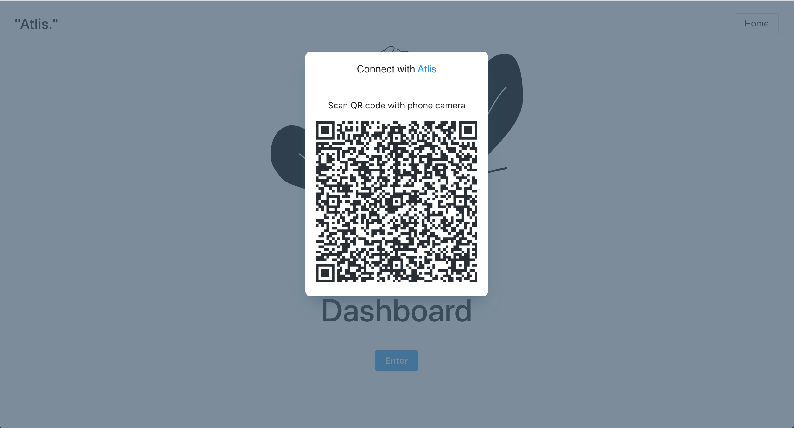
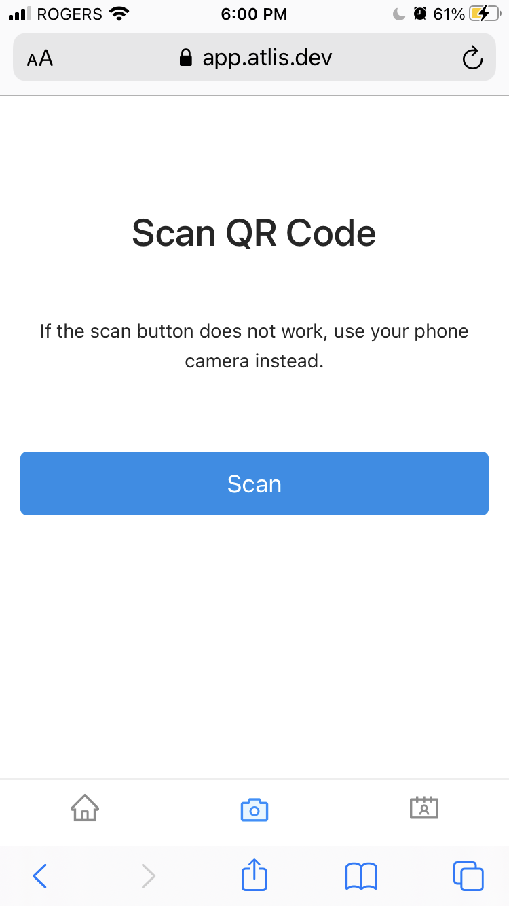

# berlin

These lambdas work as the bridge between the npm package that contains the qr code modal that opens a websocket and the mobile web app that opens a websocket when scanning qr code.

  

  

